## Вопросы для подготовки к вступительным экзаменам в магистратуру НовГУ
### Инструкция по обновлению: 
    1. Делаете форк репозитория
    2. Отправляете свою ИЗМЕНЕННУЮ ветку в пул реквест основного репа
    3. Ждете апрува
    4. Аминь
    5. Заголовки под тегом '###'. Пример: '### Жизненный цикл БД'.

### 1. Задачи и этапы проектирования и создания базы данных. Жизненный цикл базы данных.

Проектирование базы данных - процесс создания схемы базы данных и определения необходимых ограничений целостности.

Процесс проектирования базы данных охватывает несколько основных сфер:

	1. Проектирование объектов базы данных (таблицы, представления, индексы, триггеры, хранимые процедуры, функции, пакеты)
 	   для представления данных предметной области в базе данных;
	2. Проектирование интерфейса взаимодействия с базой данных (формы, отчеты и т.д.), т.е. проектирование приложений,
 	   которые будут сопровождать данные в базе данных и реализовывать вопросно-ответные отношения на этих данных;
 	3. Проектирование баз данных под конкретную вычислительную среду или информационную технологию 
  	   (архитектура "клиент-сервер", параллельные архитектуры, распределенная вычислительная среда);
	4. проектирование баз данных под назначение системы (интеллектуальный анализ данных, OLAP, OLTP и т.д.).

Основные этапы проектирования баз данных

1.Концептуальное (инфологическое) проектирование

	Концептуальное (инфологическое) проектирование — построение семантической (смысловой) модели предметной 
  	области, то есть информационной модели наиболее высокого уровня абстракции. Такая модель создаётся без
   	ориентации на какую-либо конкретную СУБД и модель данных. Термины «семантическая модель»,
    	«концептуальная модель» и «инфологическая модель» являются синонимами. Инфологическая модель является как образом
     	реальности, так и образом проектируемой базы данных для этой реальности.

	Чаще всего концептуальная модель базы данных включает в себя:
    		1. Описание информационных объектов, или понятий предметной области и связей между ними.
    		2. Описание ограничений целостности, т.е. требований к допустимым значениям данных и к связям между ними.

2.Логическое (даталогическое) проектирование

	Логическое (даталогическое) проектирование — создание схемы базы данных на основе конкретной модели данных,
	например, реляционной модели данных. Для реляционной модели данных даталогическая модель — набор схем
	отношений, обычно с указанием первичных ключей, а также «связей» между отношениями, представляющих собой внешние ключи.

3.Физическое проектирование

	Физическое проектирование — создание схемы базы данных для конкретной СУБД. Специфика конкретной СУБД может
 	включать в себя ограничения на именование объектов базы данных, ограничения на поддерживаемые типы данных и т.п.
  	Кроме того, специфика конкретной СУБД при физическом проектировании включает выбор решений, связанных с
   	физической средой хранения данных (выбор методов управления дисковой памятью, разделение БД по файлам и устройствам, 
    	методов доступа к данным), создание индексов и т.д.
    
Модели «сущность-связь»

	Для представления конкретного вида и содержания инфологической модели предметной области, как уже говорилось, в основном используется модель
 	«сущность-связь» (англ. “Entity-Relationship model”), 	или ER-модель, предложенная П. Ченом[1] в 1976 г.
  	ER-модель обычно представляется в графической форме. Основные преимущества ER-моделей:

    		1. Наглядность;
		2. Модели позволяют проектировать базы данных с большим количеством объектов и атрибутов;
  		3. ER-модели реализованы во многих системах автоматизированного проектирования баз данных (например, ERWin).

Основные элементы ER-моделей:

    		1. Объект (сущность)- любой различимый объект (объект, который мы можем отличить от другого),
      		информацию о котором необходимо хранить в базе данных. Сущностями могут быть люди, места, самолеты, рейсы, вкус,
		цвет и т.д.;

    		2. Атрибут объекта - поименованная характеристика сущности. Его наименование должно быть уникальным 
      		для конкретного типа сущности, но может быть одинаковым для различного типа сущностей 		
		(например, ЦВЕТ может быть определен для многих сущностей: СОБАКА, АВТОМОБИЛЬ, ДЫМ и т.д.). 
  		Атрибуты используются для определения того, какая информация должна быть собрана о сущности.
    		Примерами атрибутов для сущности АВТОМОБИЛЬ являются ТИП, МАРКА, НОМЕРНОЙ ЗНАК, ЦВЕТ и т.д.

    		3. Ключ – минимальный набор атрибутов, по значениям которых можно однозначно найти требуемый экземпляр сущности.
      		Минимальность означает, что исключение из набора любого атрибута не позволяет идентифицировать сущность
		по оставшимся. Для сущности Расписание движения самолетов ключом является атрибут Номер_рейса или набор: 
  		Пункт_отправления, Время_вылета и Пункт_назначения (при условии, что из пункта в пункт вылетает в каждый момент времени один самолет).

    		4. Связь – ассоциирование двух или более сущностей. Если бы назначением базы данных было только хранение отдельных,
      		не связанных между собой данных, то ее структура могла бы быть очень простой. Однако одно из основных
		требований к организации базы данных – это обеспечение возможности отыскания одних сущностей по значениям других,
  		для чего необходимо установить между ними определенные связи. А так как в реальных базах данных нередко содержатся
    		сотни или даже тысячи сущностей, то теоретически между ними может быть установлено более миллиона связей.
      		Наличие такого множества связей и определяет сложность инфологических моделей.

Связь между сущностями характеризуется:

    1. Типом связи (1:1, 1:N, N:М);
    2. Классом принадлежности. Класс может быть обязательным и необязательным. Если каждый экземпляр
    сущности участвует в связи, то класс принадлежности — обязательный, иначе — необязательный.

Жизненный цикл БД включает в себя 7 этапов:

    а. Предварительное планирование БД
    б. Проверка возможности существования (есть ли необходимые технологии для определения БД)
    в. Определение требований (цели, потребности, требования к обороудованию, ПО)
    г. Концептуальное проектирование (Создаются модели данных на основе пользовательских представлений,
      затем эти представлений складывают воедино 
       и получают че то вразумительное, ну или иными словами - концепцию БД)
    д. Логическое проектирование (Выбор типа модели данных, идет следом за концептуальным)
    е. Физическое проектирование (расширение модели данных с учетом всех факторов и рекомендаций для
       дальнейшего деплоя в сетку приложений)
    ж. Оценка и поддержка БД

	Предварительное планирование конкретной системы управления базами данных осуществляется в процессе разработки стратегического
     	плана. Ищутся ответы на следующие вопросы:
      
    		а. Сколько используется прикладных программ и какие функции они выполняют?
    		б. Какие файлы связаны с каждым из этих приложений?
		в. Какие новые приложения и файлы находятся в процессе создания?

	Проверка осуществимости включает подготовку отчетов по следующим вопросам:

   		а. Технологическая осуществимость. Есть ли технология, необходимая для реализации запланированной базы данных?
    		б. Операционная осуществимость. Располагает ли компания персоналом, средствами и экспертами,
      		   необходимыми для успешного осуществления плана создания базы данных?
    		в. Экономическая целесообразность. Можно ли определить выгоды? Окупается ли запланированная система? Можно ли измерить издержки и выгоду?

	Определение требований включает выбор целей базы данных, выяснение информационных потребностей различных отделов\
 	и руководителей компании и требований к оборудованию и программному обеспечению.

	Этап концептуального проектирования включает создание концептуальной схемы базы данных. Спецификации
 	разрабатываются в той степени, которая требуется для перехода к реализации. На этом этапе создаются подробные модели
  	пользовательских представлений данных; затем они интегрируются в концептуальную модель, фиксирующую все элементы
   	корпоративных данных, которые будет содержать база данных.

	В процессе реализации базы данных выбирается и приобретается СУБД, затем подробная концептуальная модель превращается
 	в проект реализации базы данных; создается словарь данных, база данных наполняется данными, создаются
  	прикладные программы и обучается пользователь.

	Оценка включает опрос пользователей с целью выяснения, какие информационные потребности остались неучтенными.
 	В случае необходимости вносятся изменения. Обеспечивается поддержка системы путем внесения изменений и добавления новых программ и элементов данных по мере расширения и изменения потребностей 	бизнеса. 

Источники:
  
1. **Web SQL Database** - www.w3.org
2. **SQLite Documentation** - www.sqlite.org/docs.html
3. **MS SQL Documentation** - www.learn.microsoft.com/ru-ru/sql/sql-server/
4. **Базы данных : учеб, пособие для вузов** - Кузин А. В.
5. **Основы SQL : учеб, пособие для вузов** - Полякова Л. Н.

### 4. Управление транзакциями. Модель транзакции. Свойства транзакции. Журнализация. Проблемы многопользовательских систем. Блокировки.

#### **Транзакция**

**Транзакция** - это последовательность операций над базой данных, рассматриваемых СУБД как единое целое.

Под управлением транзакциями понимается способность управлять различными операциями над данными, которые выполняются внутри реляционной СУБД. 

Управление транзакциями необходимо для поддержания логической целостности базы данных.

Пример транзакции (SQLite):

    BEGIN TRANSACTION;

    INSERT OR ROLLBACK INTO Orders (id_product, total)
    VALUES (2, 4800);

    UPDATE OR ROLLBACK Products
        SET quantity = quantity - 6
    WHERE id_product = 2;

    INSERT OR ROLLBACK INTO Invoices (id_order, id_product, num_order, sum_order, return, date)
    VALUES (1, 2, 6, 4800, 0, DATETIME('now'));

    COMMIT TRANSACTION;

#### **Модель транзакции**

**Модель транзакции** включает в себя следующие операторы:
    
1. **Оператор COMMIT**. Если все операции успешно выполнены, то транзакция также считается успешно выполненной и СУБД фиксирует (COMMIT) все изменения данных, произведенные этой транзакцией (то есть заносит изменения во внешнюю память).

2. **Оператор ROLLBACK**. Если же хотя бы одна операция транзакции заканчивается неудачей, то транзакция считается невыполненной и производится откат (ROLLBACK) — отмена всех изменений данных, произведенных в ходе выполнения транзакции, и возврат базы данных к состоянию до начала выполнения транзакции.

3. **Оператор SAVEPOINT**. Операция точки сохранения, которая предназначена для установки в транзакции особых точек, куда в дальнейшем может быть произведен откат (при этом отката всей транзакции не происходит).

Модель транзации можно видеть на следующей схеме:

    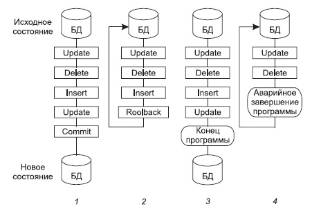

В этой схеме можно видеть следующие варианты работы транзакции:

1. Оператор COMMIT означает успешное завершение транзакции; его использование делает постоянными изменения, внесенные в базу данных в рамках текущей транзакции;

2. Оператор ROLLBACK прерывает транзакцию, отменяя изменения, сделанные в базе данных в рамках этой транзакции; новая транзакция начинается непосредственно после использования ROLLBACK;

3. Успешное завершение программы, в которой была инициирована текущая транзакция, означает успешное завершение транзакции (как будто был использован оператор COMMIT);

4. Ошибочное завершение программы прерывает транзакцию (как будто был использован оператор ROLLBACK).

#### **Свойства транзакции**

**Свойства транзакции** описываются аббревиатурой ACID (Atomicity, Consistency, Isolation, Durability):

1. **Свойство «Атомарность» (Atomicity)**. Атомарность гарантирует, что каждая транзакция будет выполнена полностью или не будет выполнена совсем. Не допускаются промежуточные состояния.

2. **Свойство «Согласованность» (Consistency)**. Данное свойство гласит, что транзакция, достигающая своего нормального завершения и, тем самым, фиксирующая свои результаты, сохраняет согласованность базы данных (то есть каждая успешная транзакция по определению фиксирует только допустимые результаты). Данное свойство «вытекает» из свойства атомарности.

3. **Свойство «Изолированность» (Isolation)**. Данное свойство означает, что транзакции параллельные транзакции не должны оказывать влияние на ее результаты.

4. **Свойство «Устойчивость» (Durability)**. Свойство означает, что если транзакция выполнена, и даже если в следующий момент произойдет сбой в системе, результат сохранится.

#### **Журнализация**

В случае аппаратных или программных сбоев может привести к повреждению данных в БД. Для восстановления информации в базе данных необходимо иметь некоторую дополнительную информацию. Таким образом, для поддержания надежности хранения данных требуется избыточность данных. Для таких целей существует **журнализация**.

**Журнал** хранит изменения, выполненные транзакциями, обеспечивает атомарность и устойчивость данных в случае сбоя системы.

**Журнал** содержит значения, которые данные имели до и после их изменения транзакцией. *Write-ahead log strategy* обязывает добавлять в журнал запись о предыдущих значениях до начала, а о конечных после завершения транзакции. В случае внезапной остановки системы БД читает лог в обратном порядке и отменяет изменения, сделанные транзакциями. Встретив прерванную транзакцию БД выполняет ее и вносит изменения о ней в журнал. Находясь в состоянии на момент сбоя, БД читает лог в прямом порядке и возвращает изменения, сделанные транзакциями.

#### **Проблемы многопользовательских СУБД**

Естественным следствием развития СУБД является проблема организации совместной работы нескольких пользователей с одной и той же совокупностью данных, или, проблемы многопользовательского доступа к данным.

Если в многопользовательской системе не реализованы механизмы совместной работы нескольких пользователей, то в СУБД это может привести к следующим проблемам:

1. **Проблема «последнего изменения»**. Возникает, когда несколько пользователей изменяют одну и ту же строку, основываясь на ее начальном значении; тогда часть данных будет потеряна, так как каждая последующая транзакция перезапишет изменения, сделанные предыдущей. Выход из этой ситуации заключается в последовательном внесении изменений;

2. **Проблема «грязного чтения»**. Возможна в том случае, если пользователь выполняет сложные операции обработки данных, требующие множественного изменения данных перед тем, как они обретут логически верное состояние. Если во время изменения данных другой пользователь будет считывать их, то может оказаться, что он получит логически неверную информацию. Для исключения подобных проблем необходимо производить считывание данных после окончания всех изменений;

3. **Проблема «неповторяемого чтения»**. Является следствием неоднократного считывания транзакцией одних и тех же данных. Во время выполнения первой транзакции другая может внести в данные изменения, поэтому при повторном чтении первая транзакция получит уже иной набор данных, что приводит к нарушению их целостности или логической несогласованности;

4. **Проблема «чтения фантомов»**. Появляется после того, как одна транзакция выбирает данные из таблицы, а другая вставляет или удаляет строки до завершения первой. Выбранные из таблицы значения будут некорректны.

Решением проблемы параллельной обработки БД заключается в том, что строки таблиц блокируются, а последующие транзакции, модифицирующие эти строки, отвергаются и переводятся в режим ожидания. Решается это с помощью блокировок.

#### **Блокировки**

**Блокировкой** называется временное ограничение на выполнение некоторых операций обработки данных. Блокировка может быть наложена как на отдельную строку таблицы, отдельную таблицу, так и на всю базу данных.

Управлением блокировками на сервере СУБД занимается менеджер блокировок, контролирующий их применение и разрешение конфликтов.

Транзакции и блокировки тесно связаны друг с другом. Транзакции накладывают блокировки на данные, чтобы обеспечить выполнение требований ACID. Без использования блокировок несколько транзакций могли бы изменять одни и те же данные.

Различают следующие типы блокировок:

1. По степени доступности данных: разделяемые и исключающие;
2. По множеству блокируемых данных: строчные, страничные, табличные;
3. По способу установки: автоматические (не явные) и явные;
4. По логике реализации: пессиместическая и оптимистическая.

Пример блокировки (MS SQL):

    LOCK TABLES users WRITE;
    INSERT INTO users (name) VALUES (‘Вася’);
    UNLOCK TABLES;

Работа с транзакциями есть и в моем проекте «Автоматизация извлечения информации о клиентах для базы 1С с применением машинного обучения». В моем случае, транзакция применяется когда пользователь захочет записать данные по всем найденным клиентам в БД. В этом случае, все временно созданные объекты пытаются записаться в транзакции. Если какой-то из объектов не удалось записать, тогда вся транзакция отменяется.

    НачатьТранзакцию();

    Попытка
        Для Каждого ТекущийОбработанныйОбъект Из ОбъектыОбработки Цикл
            ТекущийОбработанныйОбъект.ОбменДанным.Загрузка = Истина;
            ТекущийОбработанныйОбъект.Записать();
        КонецЦикла;

        ЗафиксироватьТранзакцию();
    Исключение
        ОтменитьТранзакцию();
    КонецПопытки;

Также в работе применяются и блокировки. Выполнить блокировку в 1С можно с помощью специального объекта встроенного языка 1С. Сделано это следующим образом:

	БлокировкаДанных = Новый БлокировкаДанных;
	
	ЭлементБлокировки = БлокировкаДанных.Добавить("Документ.ML_ФреймОбработкиДанных");
	ЭлементБлокировки.Режим = РежимБлокировкиДанных.Исключительный;
	ЭлементБлокировки.УстановитьЗначение("МодельМашинногоОбучения", ТекущаяМодельМашинногоОбучения);

	БлокировкаДанных.Заблокировать();

Блокировка в моей работе необходима для того, чтобы никто из пользоватей не мог редактировать дата сет по нужной модели машинного обучения, пока данная модель обучается или производится оценка ее точности.

Источники:

1. **Web SQL Database** - www.w3.org
2. **SQLite Documentation** - www.sqlite.org/docs.html
3. **MS SQL Documentation** - www.learn.microsoft.com/ru-ru/sql/sql-server/
4. **Базы данных : учеб, пособие для вузов** - Кузин А. В.
5. **Основы SQL : учеб, пособие для вузов** - Полякова Л. Н.

### 6. Организация процессов обработки данных в базе данных: формы, запросы, отчеты.

#### **База данных (БД)**

База данных (БД) — это имеющая название совокупность данных, которая отражает состояние объектов и их отношений в рассматриваемой предметной области. Данными называют зарегистрированную информацию, представление фактов, понятий или инструкций в форме, которая подходит для передачи, связи, обработки человеком или с помощью машины. Содержимое базы данных — прайс-листы, контакты пользователей, каталоги товаров, отчеты, статистика продаж и т. д. Изменения одной ячейки автоматически влияют на другие [1].

#### **Организация процессов обработки данных**

Организация процессов обработки данных в базах данных предполагает использование различных инструментов, таких как формы, запросы и отчеты. Каждый из этих инструментов служит определенной цели в организации процессов обработки данных.

Обработка данных включает набор различных функций и операций, которые можно разделить на три группы:
•   поиск, фильтрация и сортировка данных;
•   запросы к базе данных;
•   механизм реализации событий, правил и процедур в базе данных.

#### **Формы**

Формы — это инструмент для ввода и извлечения данных из баз данных. Формы обеспечивают удобный интерфейс для ввода и поиска данных. Формы разработаны так, чтобы отражать структуру данных в базе данных, упрощая и повышая эффективность ввода и извлечения данных. Формы можно настраивать в соответствии с конкретными потребностями организации, позволяя добавлять или удалять поля в зависимости от вводимых или извлекаемых данных.

Разрабатывая приложение, можно задавать значения всех свойств компонентов с помощью форм. При этом требуемые значения либо непосредственно вводятся в поле, либо выбираются в раскрывающихся списках. В последнем случае приложение создается с помощью мыши и не требует набора каких-либо символов на клавиатуре.

Компоненты, используемые для работы с таблицей БД, их основные свойства и значения этих свойств:

    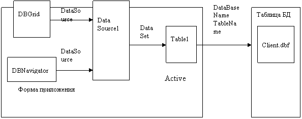

*Например, при разработке базы данных для своего проекта VR-симуляции я изменял данные с помощью форм, так как в ходе разработки приложения определялись более подходящие варианты значений текстовых заголовков, описаний. Изменение данных с помощью форм подходящий вариант для такого случая, так как изменения данных происходили часто, но они не настолько значительные, чтобы организовывать для них новый запрос вручную.*

    

#### **Запросы**

Запросы — это инструмент, который позволяет пользователям извлекать данные из базы данных на основе определенных критериев. Запросы позволяют пользователям создавать отчеты и отвечать на вопросы о данных в базе данных. Запросы настраиваются, что позволяет пользователям указывать поля для извлечения и критерии для извлечения данных. Запросы можно сохранять и использовать повторно, что упрощает создание отчетов и ответов на вопросы о данных в базе данных.
Формирование запросов в СУБД может осуществляться в специальном редакторе (командный режим) или через наглядно-диалоговые средства (конструкторы) и пошаговые мастера формирования запросов. Сформированный запрос в виде SQL-инструкции сохраняется в файле базы данных и впоследствии специальной командой СУБД может открываться на выполнение.

С точки зрения решаемых информационных задач и формы результатов исполнения запросов их можно разделить на три группы:
•   запросы на выборку данных;
•   запросы на изменение данных;
•   управляющие запросы.

1.  Пример запроса на выборку:
    SELECT title, price FROM goods
2.  Пример запроса на изменение данных:
    UPDATE goods SET price = price / 2 WHERE price >= 100
3.  Пример управляющего запроса:
    CREATE TABLE “Виджеты”

Запросы на выборку относятся к одному из наиболее часто применяемых видов запросов. Данный вид запросов реализуется SQL-инструкцией SELECT с предложением FROM. Результатом исполнения запроса на выборку является набор данных, который представляет временную таблицу данных со структурой (поля, их типы и параметры), определяемой параметрами запроса и параметрами полей таблиц, из которых выбираются данные. Результаты запросов на выборку помещаются в специальную временную таблицу, размещаемую на период исполнения («открытия») запроса в оперативной памяти.
Важное значение для решения различных технологических информационных задач по ведению базы данных имеют запросы на изменение данных. В отличие от непосредственного ввода данных в режимах открытой таблицы или формы они вносят изменения сразу в группу записей за одну операцию. Таким образом, результатом запросов на изменение является не набор данных, как в запросах на выборку, а изменение данных в самих таблицах.
При исполнении запроса на удаление за одну операцию осуществляется удаление группы записей из одной или нескольких таблиц. Запросы на удаление реализуются SQL-инструкцией DELETE.

*Например, при разработке базы данных для своего проекта я реализовал запрос-выборку записей из таблицы “Виджеты”, где поле “Количество слайдов” равно 1, так как такие виджеты можно создать при запуске приложения без инициализации.*

    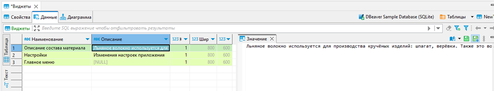

#### **Отчеты**

Отчеты — это инструмент для представления данных из базы данных в осмысленной и лаконичной форме. Отчеты формируются на основе данных, извлеченных из базы данных посредством запросов. Отчеты можно настроить так, чтобы они включали определенные поля и параметры форматирования данных, такие как графики, таблицы и диаграммы. Отчеты можно распечатать или отправить в электронном виде в различных форматах, таких как PDF, Excel или HTML.
Для создания отчёта необходимо выбрать источник записей. Источником записей для отчета может быть таблица, именованный или внедренный запрос. Источник записей должен содержать все строки и столбцы данных, которые требуется отобразить в отчете.
Отчёты, в отличие от форм, имеют дополнительные инструменты для улучшения восприятия данных. Примеры инструментов: добавление группировки, сортировки и итогов; выделение данных с помощью условного форматирования; настройка цвета и шрифтов; добавление логотипа или фонового рисунка.

    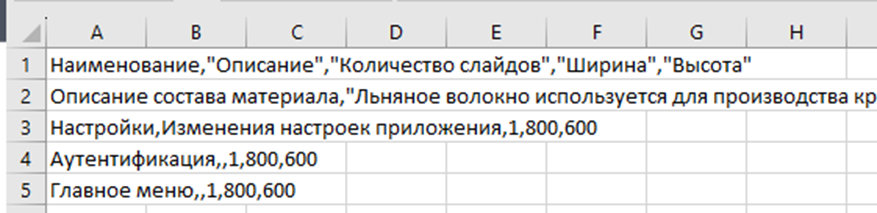

Используя формы, запросы и отчеты, организации могут эффективно организовать свои процессы обработки данных, упрощая и повышая эффективность ввода, поиска и анализа данных. Используя эти инструменты, организации могут улучшить свои процессы принятия решений и получить представление о своих данных, что позволит им принимать обоснованные решения на основе данных в своей базе данных.

В заключение, формы, запросы и отчеты являются ключевыми инструментами для организации процессов обработки данных в базах данных. Каждый из этих инструментов служит определенной цели, помогая организациям эффективно вводить, извлекать и анализировать данные из своих баз данных. Используя эти инструменты, организации могут улучшить свои процессы принятия решений, получить представление о своих данных и в итоге достичь своих стратегических целей.

Источники:
1. Ian Hickson, Web SQL Database, w3.org, https://www.w3.org/TR/webdatabase/
2. SQLite Documentation - www.sqlite.org/docs.html
3. MS SQL Documentation - www.learn.microsoft.com/ru-ru/sql/sql-server/
4. Базы данных: учебное пособие для вузов - Кузин А. В.
5. Основы SQL: учебное пособие для вузов - Полякова Л. Н.

### 9. Архитектура многопользовательских СУБД. Модель сервера баз данных. Сервер приложений. Трехуровневая модель.

#### **Архитектура многопользовательских СУБД.**

**Система управления базами данных (СУБД)** — совокупность
языковых и программных средств, предназначенных для создания, ведения
и совместного использования БД многими пользователями.

В зависимости от разделения функций между клиентом и сервером выделяются несколько типов архитектур систем БД, среди них:

#### **Модель сервера баз данных.**

Основу данной модели составляют следующие механизмы:
1. Механизм хранимых процедур - как средство программирования SQL-сервера;
2. Механизм триггеров - как механизм отслеживания текущего состояния информационного хранилища
3. Механизм ограничений на пользовательские типы данных, который иногда называется механизмом поддержки доменной структуры.

В этой модели бизнес-логика разделена между клиентом и сервером.
- На сервере бизнес-логика реализована в виде хранимых процедур — специальных программных модулей, которые хранятся в БД и управляются непосредственно СУБД.
- Клиентское приложение обращается к серверу с командой запуска хранимой процедуры, а сервер выполняет эту процедуру и регистрирует все изменения в БД, которые в ней предусмотрены. По итогу, сервер возвращает клиенту данные, релевантные его запросу, которые требуются клиенту либо для вывода на экран, либо для выполнения части бизнес-логики, которая расположена на клиенте.
    
Централизованный контроль в модели сервера баз данных выполняется с использованием механизма триггеров. Триггеры также являются частью БД. Механизм использования триггеров предполагает, что при срабатывании одного триггера могут возникнуть события, которые вызовут срабатывание других триггеров. Этот мощный инструмент требует тонкого и согласованного применения, чтобы не получился бесконечный цикл срабатывания триггеров.

В данной модели сервер является активным, потому что не только клиент, но и сам сервер, используя механизм триггеров, может быть инициатором обработки данных в БД. И хранимые процедуры, и триггеры хранятся в словаре БД, они могут быть использованы несколькими клиентами, что существенно уменьшает дублирование алгоритмов обработки данных в разных клиентских приложениях. Данную модель поддерживают большинство современных СУБД.

Модель сервера баз данных можно видеть на следующей схеме:

    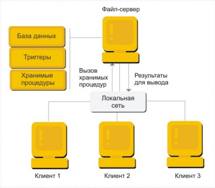

#### **Сервер приложений. Трехуровневая модель.**

Эта модель является расширением двухуровневой модели. Данная архитектура предполагает наличие дополнительного сервера приложений, который проводит предварительную обработку запросов клиентов, формирует запросы к серверу БД и обрабатывает полученные результаты перед отправкой их клиенту.

В этой модели компоненты приложения делятся между тремя исполнителями:

1. Клиент обеспечивает логику представления, включая графический пользовательский интерфейс, локальные редакторы; клиент может запускать локальный код приложения клиента, который может содержать обращения к локальной БД, расположенной на компьютере-клиенте. Клиент исполняет коммуникационные функции front-end части приложения, которые обеспечивают доступ клиенту в локальную или глобальную сеть. Дополнительно реализация взаимодействия между клиентом и сервером может включать в себя управление распределенными транзакциями, что соответствует тем случаям, когда клиент также является клиентом менеджера распределенных транзакций.

2. Серверы приложений составляют новый промежуточный уровень архитектуры. Они спроектированы как исполнения общих незагружаемых функций для клиентов. Серверы приложений поддерживают функции клиентов как частей взаимодействующих рабочих групп, поддерживают сетевую доменную операционную среду, хранят и исполняют наиболее общие правила бизнес-логики, поддерживают каталоги с данными, обеспечивают обмен сообщениями и поддержку запросов, особенно в распределенных транзакциях.

3. Серверы баз данных в этой модели занимаются исключительно функциями СУБД: обеспечивают функции создания и ведения БД, поддерживают целостность реляционной БД, обеспечивают функции хранилищ данных (warehouse services). Кроме того, на них возлагаются функции создания резервных копий БД и восстановления БД после сбоев, управления выполнением транзакций и поддержки устаревших (унаследованных) приложений (legacy application).

Преимущества трехуровневой модели наиболее заметны в тех случаях, когда клиенты выполняют сложные аналитические расчеты над базой данных. 

Трехуровнивую модель можно видеть на следующей схеме:

    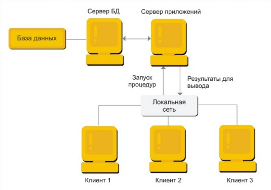

Трехуровневая модель применяется и в моем проекте «Автоматизация извлечения информации о клиентах для базы 1С с применением машинного обучения». Применяется она следующим образом: вся бизнес-логика реализована на сервере 1С, который может выполнять различные запросы на добавления, чтения, изменения или удаления данных на сервер БД. Результаты работы с БД сервер 1С отправляет пользователям, которые используют тонкий клиент 1С. Результаты работы отображаются в виде изменных форм приложения или различных сообщений, отчетов и прочего.

Схему работы можно видеть ниже:

    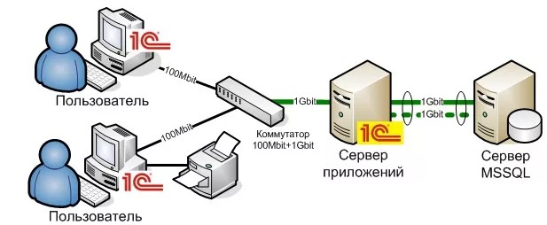

1. **Web SQL Database** - www.w3.org
2. **SQLite Documentation** - www.sqlite.org/docs.html
3. **MS SQL Documentation** - www.learn.microsoft.com/ru-ru/sql/sql-server/
4. **Базы данных : учеб, пособие для вузов** - Кузин А. В.
5. **Основы SQL : учеб, пособие для вузов** - Полякова Л. Н.

### 11. Основные алгоритмические структуры. Операторы условного и безусловного перехода. Циклические структуры, включая цикл foreach.

#### ***Основные алгоритмические структуры.***

**Алгоритмическая структура** - это структура, где каждая часть предназначена для выполнения определенного алгоритма преобразования информации 

Логическая структура любого алгоритма может быть представлена комбинацией трех базовых структур: *следование*, *ветвление*, *цикл*.

Самая простая из них - это **следование**. **Следование** — это часть алгоритма, в которой все команды исполняются одна за другой в порядке их записи. Алгоритм, в котором есть структура «следование» называется линейным. действие_1 действие_2 ... действие_n.

Схема:

    

Пример (Си):

    int a = 5;
    int b = 10;
    int c = a + b;

#### ***Операторы условного и безусловного перехода.***

Следующая группа алгоритмических структур - операторы условного и безусловного перехода.

**Ветвление** – это выбор действия в зависимости от выполнения какого-нибудь условия. Алгоритм, в котором есть структура «ветвление» называется разветвляющимся. 

Структура ветвление существует в четырех основных вариантах:

1. **если–то**; в этом случае выполнится действие (или группа действий), расположенное в строке то только при соблюдении условия. Если же условие не соблюдается, то исполнитель перейдет к выполнению действий, следующих за служебным словом все.

    Схема:

    

        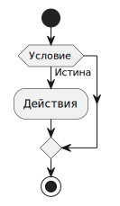
    

    Пример (Си):

        if (a > b) {
            return a;
        }

2. **если–то-иначе**; здесь представлена полная форма ветвления. В полной форме в зависимости от условия в строке если выполняется только одно из действий ( или группа действий), расположенных либо в строке то (условие соблюдено), либо в строке иначе (условие не соблюдено).

    Схема (Общая):

    

        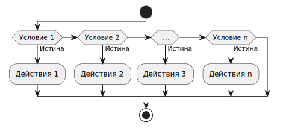
    

    Пример (Си):

        if (a > b) {
            return a;
        } else {
            return b;
        }

    Или пример с множественным ветвлением (Си):

        if (a > b) {
            return a;
        } else if (b > a) {
            return b;
        } else {
            return c;
        }

3. **Оператор множественного выбора**; Данный оператор сопоставляет значение заданного выражения с заранее предусмотренными вариантами. В большинстве языках реализован через оператор switch. Любую конструкцию выбора можно переписать в стандартное ветвление.

    Схема:

    

        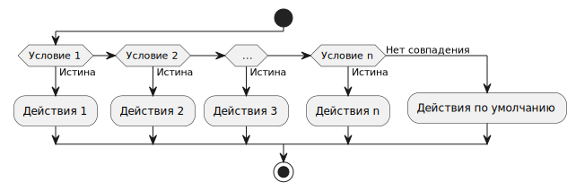
    

    Пример (Си):

        switch (keyCode) {
            case 1:
                // Действия для значения 1.
                break;
            case 2:
                // Действия для значения 2.
                // Обратите внимание, что нет оператора break;
                // Поэтому при выполнения case 2 выполнится case 3.
            case 3:
                // Действия для значения 3.
                break;
            default:
                // Действия, если не сопоставилось не один case.
                break;
        }

**Оператор безусловного перехода**. Оператор безусловного перехода goto означает «перейти к» и применяется в случаях, когда после выполнения некоторого оператора надо выполнить не следующий по порядку, а какой-либо другой, отмеченный меткой, оператор. Все языки программирования имели в свое время, а некоторые и до сих пор предлагают оператор goto, чье имя образовано слиянием двух английских слов "go to" (перейти к).

Применение оператора безусловного перехода считается «плохим тоном», по причине того, что данный оператор может привести к созданию нечитаемого «спагетти-кода» (очень запутанного кода).

Пример (Си):

    for (int i = 0; i < 5; i++) {
        for (int j = 0; j < 5; j++) {
            if (i == 3) {
                goto exit_jump;
            }
        }
        printf("%i\n", i);
    }

    exit_jump: printf("exit");

#### ***Циклические структуры, включая цикл foreach.***

И наконец, циклическая группа.

**Цикл** – это неоднократное повторение каких–либо действий. Алгоритм, в котором есть структура «цикл» называется циклическим. Обеспечивает многократное выполнение некоторой совокупности действий, которая называется телом цикла.

Основные разновидности циклов:

1. Цикл с предусловием; Цикл, который выполняется, пока истинно некоторое условие, указанное перед его началом. Это условие проверяется до выполнения тела цикла, поэтому тело может быть не выполнено ни разу (если условие с самого начала ложно). В большинстве процедурных языков программирования реализуется оператором while, отсюда его второе название — while-цикл.

    Схема:

    

        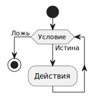
    

    Пример (Си):

        int a = 0;

        while (a++ < 5) {
            printf("%i\n", a);
        }

2. Цикл с постусловием; Цикл, в котором условие проверяется после выполнения тела цикла. Отсюда следует, что тело всегда выполняется хотя бы один раз.

    Схема:

    

        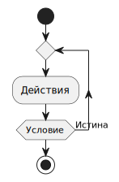
    

    Пример (Си):

        int a = 1;

        do {
            printf("%i\n", a);
        } while (a++ < 5);

3. Цикл со счетчиком; Цикл, в котором некоторая переменная изменяет своё значение от заданного начального значения до конечного значения с некоторым шагом, и для каждого значения этой переменной тело цикла выполняется один раз. В большинстве процедурных языков программирования реализуется оператором for, в котором указывается счётчик (так называемая «переменная цикла»), требуемое количество проходов (или граничное значение счётчика) и, возможно, шаг, с которым изменяется счётчик.

    Схема:

    

        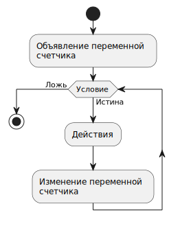
    

    Пример (Си):

        for (int i = 1; i <= 5; i++) {
            printf("%i", i);
        }

4. Цикл foreach; Цикл, задающий выполнение некоторой операции для объектов из заданного множества, без явного указания порядка перечисления этих объектов. Такие циклы называются совместными (а также циклами по коллекции, циклами просмотра) и представляют собой формальную запись инструкции вида: «Выполнить операцию X для всех элементов, входящих во множество M».

    Пример (Python):

        lst = [1, 2, 3, 4, 5]

        for lst_elem in lst:
            print(lst_elem)

Все приведенные алгоритмические структуры и используются в моем проекте «Автоматизация извлечения информации о клиентах для базы 1С с применением машинного обучения».

Пример ветвления из проекта (Встроенный язык 1С):

	Если ЭтоДокумент Тогда
		СтандартныеРеквизитыЗаполнены	= ЗначениеЗаполнено(ОбрабатываемыйОбъект.Дата);
		СтандартныйРеквизитОтказаЗаписи	= "Дата";
	Иначе
		СтандартныеРеквизитыЗаполнены	= ЗначениеЗаполнено(ОбрабатываемыйОбъект.Наименование);
		СтандартныйРеквизитОтказаЗаписи	= "Наименование";
	КонецЕсли;

Источники:

1. **WebAssembly Core Specification** - www.w3.org
2. **The GNU C Reference Manual** - www.gnu.org/software/gnu-c-manual
3. **Информатика и программирование. Основы информатики** - Н. И. Парфилова.
4. **Алгоритмы и структуры данных** - Гагарина Л. Г.

### 14. Члены класса. Атрибуты и методы. Сигнатура и тело функции. Статические члены класса. Конструкторы с параметрами и без.

Члены класса, атрибуты и методы, играют важнейшую роль в объектно-ориентированном программировании. Они представляют данные и поведение класса.

#### **Атрибуты**

Атрибуты — это переменные, которые содержат данные и определяют состояние объекта. Они могут быть разных типов, например целочисленные, с плавающей запятой, строковые или определённые пользователем объекты. Они объявлены внутри класса, и к ним можно получить доступ и изменить их с помощью экземпляров объекта или экземпляров класса. Например, класс “Person” может иметь такие атрибуты: “Name”, “Age”, “Gender”.

Пример использования атрибутов при разработке класса на языке C#:

    class Person {
        public string Name;
        public int Age;
        public GenderType Gender;
    }

#### **Уровни доступа**

Во многих языках программирования атрибутам, так же, как и другим членам класса, можно задавать различный уровень доступа к данному члену класса. Инструмент определения доступа к членам класса необходим в процессе инкапсулирования класса [1]. Основные уровни доступа это:

1. Public – член класса доступен на любом уровне – им может манипулировать сам класс, имеющий данный член; наследники класса; пользователи класса.
2. Protected – доступен для изменения самим классом, наследниками.
3. Private – доступен только для самого класса [2].

*Например, при разработке своего проекта VR-симуляции я реализовал класс ItemsGrabber, который имеет различные уровни доступа к членам класса. Класс отвечает за подбор предметов, имеет public метод GrabItem, private атрибуты класса для реализации поведения.*

    Реализация на языке C# следующая:
    public class ItemsGrabber
    {
      private const int grabMagnitude = 100;
      public void Grab(Item item) 
      { 
        if (item.magnitude < grabMagnitude) return;
        Item.grab();
      }
    }

#### **Методы**

Методы представляют поведение класса. Это функции, которые могут манипулировать атрибутами объекта или выполнять некоторые другие действия. Методы объявляются внутри класса, и доступ к ним можно получить с помощью экземпляров объекта. В том же примере класса “Person” методами могут быть “changeName”, “calculateAge” и “printInfo”.
Сигнатура функции относится к списку параметров и их типов данных для функции, а также к типу возвращаемого значения функции. Например, функция сложения двух целых чисел может иметь сигнатуру: int Add (int num1, int num2);
Тело функции относится к реализации функции и содержит фактический код функции для выполнения своей задачи. Для приведенной выше сигнатуры тело функции может быть:

    int Add(int num1, int num2) { return num1 + num2; }

#### **Статические члены класса**

Статические члены класса — это атрибуты или методы, связанные с классом, а не с экземпляром этого класса. Они объявляются с помощью ключевого слова «static», и к ним можно получить доступ без необходимости создания экземпляра объекта класса. Статические члены полезны для создания общих данных между всеми объектами класса или для реализации служебных функций, которым не требуется доступ к каким-либо данным, относящимся к конкретному экземпляру.

*Например, при разработке своего проекта VR-симуляции я реализовал класс WidgetCreator, который имел статический член класса GlobalWidgetCount, это целочисленный атрибут, который инкрементировался при создании виджета из любого экземпляра класса и декрементировался при уничтожении виджета из любого экземпляра класса.*

    Реализация на языке программирования C# следующая:
    public class WidgetCreator
    {
       private static int GlobalWidgetCount = 0;
       public static int GetGlobalWidgetCount() { return GlobalWidgetCount; }
       public Widget CreateWidget() { GlobalWidgetCount++; return new Widget(); }
       public void DeleteWidget(Widget* widget) {widget.Dispose(); delete widget; GlobalWidgetCount—;}
    }

#### **Конструкторы с параметрами и без**

Конструкторы — это специальные типы методов, которые вызываются при создании объекта класса. Они используются для инициализации атрибутов объекта. Конструкторы могут быть двух типов: с параметрами и без них.
Конструкторы без параметров являются конструкторами по умолчанию. Они не принимают никаких аргументов и имеют пустую реализацию. Например, рассмотрим следующий код:

    class Person
    {
       public string Name;
       public int Age;
       public Person() { }
    }

Приведенный выше код объявляет класс “Person” без какого-либо параметризованного конструктора. Инициализировать атрибуты “Name” и “Age” в таком случае необходимо через обращение к атрибутам экземпляра класса. Например:

    Person worker = new Person();
    Worker.Name = “Oleg”;
    Worker.Age = 22;

Конструкторы с параметрами принимают один или несколько аргументов, которые используются для инициализации атрибутов объекта. Например, рассмотрим следующий код:

    class Person
    {
       public string Name;
       public int Age;
       public Person(string name, int age)
       {
           this.Name = name;
           this.Age = age;
       }
    }

Приведенный выше код объявляет класс “Person” с параметризованным конструктором, который принимает два аргумента: “name” и “age”. Ключевое слово this используется для ссылки на текущий создаваемый объект.

    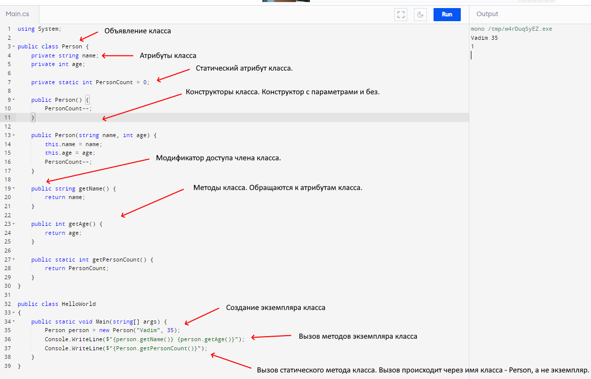

В заключение, понимание членов класса, включая атрибуты и методы, сигнатуру и тело функции, статические члены класса и конструкторы с параметрами и без них, необходимо для создания объектно-ориентированных программ. Эти концепции позволяют создавать хорошо спроектированный и организованный код, эффективный и удобный в сопровождении.

Источники:
1. Classes, attributes and methods - www.w3.org
2. w3schools, C++ Encapsulation - https://www.w3schools.com/cpp/cpp_encapsulation.asp
3. Microsoft, Модификаторы доступа (Руководство по программированию в C#) - https://learn.microsoft.com/ru-ru/dotnet/csharp/programming-guide/classes-and-structs/access-modifiers

### 16. Многопоточное программирование. Потоки. Асинхронное программирование.

Многопоточное программирование относится к технике создания и запуска нескольких потоков в рамках одной программы. Эти потоки могут работать одновременно, выполняя несколько задач одновременно, и могут помочь повысить производительность и эффективность программы.

В одно процессной однопоточной среде все запросы, например, к интерфейсу ввода-вывода, блокируют любое дальнейшее продвижение процесса. Любая комбинация многопроцессорной или многопоточной реализации программы позволяет пользователю приложения запрашивать несколько файлов, веб-страниц, медиаресурсов одновременно. 

В качестве примера рассмотрим взаимодействие пользователя с веб-сайтом. Поскольку ожидается, что клиент World-Wide Web будет использовать большую часть времени выполнения для операций ввода-вывода, таких как «подключение» и «чтение», можно получить высокую степень оптимизации, если несколько потоков могут выполняться одновременно. Параллельное исполнение — это строгое подмножество конкурентного исполнения. Это значит, что на компьютере с одним процессором параллельное программирование – невозможно [1].

#### **Поток**

Поток — это облегченная единица выполнения, которая может выполняться одновременно с другими потоками в программе. Потоки используются для одновременного выполнения нескольких задач и совместно используют одно и то же пространство памяти, что упрощает обмен данными между ними. Как правило, потоки управляются операционной системой, а их выполнение запланировано планировщиком.

    

Синхронизация потоков важна в многопоточном программировании, чтобы избежать состояния гонки (race condition) и обеспечить безопасный и согласованный доступ потоков к общим данным. Такие методы, как блокировка, мониторинг, семафор и мьютекс, могут использоваться для реализации синхронизации потоков и предотвращения одновременного доступа потоков к общим ресурсам, что приводит к повреждению данных, несоответствиям и другим проблемам.

*В качестве примера синхронизации потоков приведу использование семафора при разработке своего проекта. Я использовал семафор при реализации метода, работающего с общими ресурсами. Метод асинхронно закрывает открытый в данный момент виджет, и если во время закрытия виджета другой поток снова вызовет этот метод, то возникнет ошибка.
Реализация на языке C# с использованием ключевого слова lock*:

    private static readonly object BalanceLock = new();
    public async Tak AsyncHide() 
    {
      Widget currentWidget = widgetQueue.Deque();
      lock (BalanceLock)
      {
        await InternalAsyncHide(currentWidget);
      }
    }

#### **Пул потоков**

Пул потоков — это набор потоков, которые можно использовать для одновременного выполнения задач в программе. Пул потоков управляет фиксированным количеством потоков и может выделять их задачам по мере необходимости. Пулы потоков полезны для повышения производительности и масштабируемости программы, поскольку они могут повторно использовать существующие потоки вместо создания новых для каждой задачи.

#### **Асинхронное программирование**

Асинхронное программирование — это тип программирования, который позволяет программе эффективно выполнять задачи неблокирующим образом. Это означает, что вместо того, чтобы ждать завершения задачи перед переходом к следующей, программа может продолжать выполнять другие задачи, пока первая выполняется в фоновом режиме. Этот метод полезен для задач, выполнение которых занимает много времени, таких как чтение или запись данных из файла или выполнение сложных вычислений.

    

Асинхронное программирование может быть реализовано с использованием различных методов, таких как обратные вызовы, промисы и асинхронность/ожидание. Эти методы позволяют программе планировать задачи и обрабатывать их завершение асинхронно, что делает ее более быстрой и эффективной.

При этом асинхронная операция не предполагает использование многопоточности, ведь асинхронная операция может быть выполнена на удалённом устройстве: веб-узлом, сервером, другим устройством за пределами текущего вычислительного устройства. Отличие асинхронной операции от многопоточности изображено далее:

    

*Например, при разработке своего проекта VR-симуляции я реализовал асинхронную операцию с продолжением работы программы. Программа асинхронно ожидает ввод пользователя на клавиатуре и реагирует созданием и открытием виджета на экране пользователя, при этом основной поток программы не блокируется и продолжает свою работу.
Реализация на языке C#*:

    public Task GetUserInput()
    {
      CancellationTokenSource token = new();
      wigetButton.onClick.addListener(token.TrySetResult);
      return token.Task;
    } 

В заключение можно сказать, что многопоточное программирование — это мощная техника, которая позволяет программам выполнять несколько задач одновременно и повышать их производительность и эффективность. Потоки, асинхронное программирование, синхронизация потоков и пулы потоков — это некоторые из важнейших концепций многопоточного программирования, которые помогают обеспечить безопасное и эффективное выполнение параллельных задач. Эти концепции необходимы для разработки высокопроизводительных и быстро реагирующих приложений в современных вычислительных условиях.

Источники:
1. Henrik Frystyk, Multi Threaded Clients, w3.org - https://www.w3.org/People/Frystyk/thesis/multithread.html
2. Microsoft, Рекомендации по работе с потоками - https://learn.microsoft.com/ru-ru/dotnet/standard/threading/managed-threading-best-practices
3. **Информатика и программирование. Основы информатики** - Н. И. Парфилова.

### 18. UMLдиаграммы: классов, вариантов использования, деятельности, последовательностей, состояний.

UML – унифицированный язык моделирования. UML - это система обозначений, которую можно применять для объектно-ориентированного анализа и проектирования.
Его можно использовать для визуализации, спецификации, конструирования и документирования программных систем.
Как и любой другой язык, UML имеет собственные правила оформления моделей и синтаксис.
С помощью графической нотации UML можно визуализировать систему, объединить все компоненты в единую структуру,
уточнять и улучшать модель в процессе работы. На общем уровне графическая нотация UML содержит 4 основных типа элементов:

    	а. Фигуры;
    	б. Линии;
    	в. Значки;
    	г. Надписи.

UML-нотация является де-факто отраслевым стандартом в области разработки программного обеспечения, ИТ-инфраструктуры и бизнес-систем.

    а. Класс (class) — категория вещей, которые имеют общие атрибуты и операции. Диаграмма классов - структурная диаграмма
    языка моделирования UML, демонстрирующая общую структуру иерархии классов системы. Диаграмма классов являет собой
    набор статических, декларативных элементов модели. Она дает нам наиболее полное и развернутое представление о связях
    в программном коде, функциональности и информации об отдельных классах.

    	
    б. Диаграммы вариантов использования(use case) описывают взаимоотношения и зависимости между группами вариантов использования
       и действующих лиц, участвующими в процессе.
       
       Диаграмма использует 2 основных элемента: 

	1) Actor (участник) — множество логически связанных ролей, исполняемых при взаимодействии с прецедентами или
 	сущностями (система, подсистема или класс). Участником может быть человек, роль человека в системе или другая
  	система, подсистема или класс, которые представляют нечто вне сущности. 

	2) Use case (прецедент) — описание отдельного аспекта поведения системы с точки зрения пользователя.
 	Прецедент не показывает, "как" достигается некоторый результат, а только "что" именно выполняется.

  
  
       
    в. Диаграмма деятельности позволяет более детально визуализировать конкретный случай использования. Это поведенческая диаграмма,
       которая иллюстрирует поток деятельности через систему. Диаграммы активности UML также могут быть использованы
       для отображения потока событий в бизнес-процессе.
       Диаграмма активностей описывает динамические аспекты поведения системы в виде блок-схемы,
       которая отражает бизнес-процессы, логику процедур и потоки работ — переходы от одной деятельности к другой. 
       По сути, мы рисуем алгоритм действий (логику поведения) системы или взаимодействия нескольких систем.

       
    г. Диаграммы последовательности - диаграмма, на которой для некоторого набора объектов на единой временной оси показан
	жизненный цикл объекта (создание-деятельность-уничтожение некой сущности) и взаимодействие акторов 
	(действующих лиц) информационной системы в рамках прецедента.
	Диаграмма используется для уточнения диаграмм прецедентов — описывает поведенческие аспекты системы.
 	Диаграмма последовательности отражает взаимодействие объектов в динамике, во времени.
  	При этом информация принимает вид сообщений, а взаимодействие объектов подразумевает обмен этими сообщениями
   	в рамках сценария.

 
    д. Диаграмма состояний описывает процесс изменения состояний только одного класса, а точнее – одного экземпляра
       определенного класса, т. е. моделирует все возможные изменения в состоянии конкретного объекта.
       Диаграмма позволяет визуально представить различные состояния объекта или системы и показать, 
       как они изменяются в ответ на события или внешние условия. Переходы обозначают изменение состояния и указывают,
       при каких условиях происходит переход между состояниями. События являются внешними сигналами или действиями, 
       которые вызывают переходы между состояниями.

1. **Uml примеры** - https://codemanship.co.uk/parlezuml/
2. **Самоучитель UML 2.** Александр Леоненков
3. **Проектирование на UML.** Сборник задач. Валентин Полежаев, Андрей Андрианов, Антон Хританков
4. **UML 2.0. Объектно-ориентированное моделирование и разработка.** Джеймс Рамбо, М. Блаха

### 19. Рекурсивные функции и данные. Пример рекурсивного алгоритма. Достоинства рекурсии и недостатки.
	
Функция — в программировании — это поименованная часть программы, которая может вызываться из других
частей программы столько раз, сколько необходимо. Функция, в отличие от процедуры, обязательно возвращает значение.

Рекурсия — это функция, которая вызывает саму себя. Представим, что есть функция А, которая выполняет определённое действие,
— например, перемножает два значения. Внутри этой функции А в качестве одного из значений для умножения возьмём ту
же самую функцию А. Получается, что функция умножает число на саму себя и внутри ещё раз умножает число на саму себя
и так далее, до бесконечности или выполнения определённого условия.

Рекурсия функции нужна, когда требуется выполнить последовательность из одинаковых действий.
Прописывать их все слишком долго, а иногда невозможно, потому что неизвестно, сколько действий понадобится.
Например, надо создать функцию, которая выводит на экран числа от N до 1. Но конечное N неизвестно,
и нужно передавать каждый раз разное. Тут и поможет рекурсия — она каждый раз будет вызывать сама себя,
уменьшая заданное N на один, пока не дойдёт до единицы.

Рекурсия немного похожа на цикл, который тоже позволяет несколько раз повторить одно и то же действие.
Но внутри цикла функция не вызывается, только прописываются различные условия. Любую рекурсивную функцию
можно описать в виде цикла, так что теоретически рекурсии можно не использовать в коде вообще.
Однако у них есть преимущества перед циклами.

Недостатки.

      а. Скорость работы рекурсивного кода. Некоторые компиляторы могут преобразовывать хвостовую
         рекурсию в цикл, но, в целом, итеративные реализации работают быстрее практически во
         всех случаях, когда использование циклов НЕ усложняет алгоритм.
      б. Требования к размеру стека, но это решается настройками компиляции или выбором языка,
         который не ограничивает размер стека
      в. Если забыть прописать условие выхода, рекурсия будет выполняться бесконечно — программу придётся завершать принудительно.

Достоинства.

      а. Эффективность применения. Некоторые алгоритмы выглядят проще и понятнее с использованием рекурсии.
      б. Рекурсии легче реализовывать, чем итерации.
      в. Иногда код рекурсии можно упаковать в несколько строк, в то время как такой же цикл займёт
      	 десятки строк кода. В этом случае рекурсия будет выполняться быстрее аналогичного цикла.

Суть рекурсии такова, что она может вызывать сама себя вечно, никогда не заканчиваясь.
Это называется бесконечной рекурсией, выйти из которой можно только принудительным закрытием программы.

Принцип «Разделяй и властвуй» — самое популярное и частое применение для рекурсии. Декомпозиция, то есть разбиение любой
задачи на более мелкие части, — основа, на которой строится принцип рекурсии:

	1.Разделять. Решать проблему напрямую, если она небольшая. В противном случае разделить
 	задачу на меньшие подмножества той же проблемы.

	2.Властвовать. Решать меньшие задачи рекурсивно. Если подзадача достаточно мала, 
 	рекурсия не нужна и можно решить её напрямую.

	3.Комбинировать. Взять готовое решение для маленькой подзадачи и объединить с решением исходной проблемы.

	Как только большая задача будет разбита на множество мелких частей, можно использовать параллельное
 	программирование для их одновременного выполнения, ускоряя весь процесс решения.
  	Такой подход является самым быстрым и простым способом увеличить скорость алгоритма и всей программы.

Пример:

      Вычисление факториала:

      def factorial(x):
          if (x == 0):
              return 1
          return x * factorial(x - 1)

1. **Книга «Рекурсивная книга о рекурсии»** - Эл Свейгарт
2. **Искусство программирования.** Основные алгоритмы. - Дональд Кнут
3. **Функции в Python** - https://www.w3schools.com/python/python_functions.asp

    

